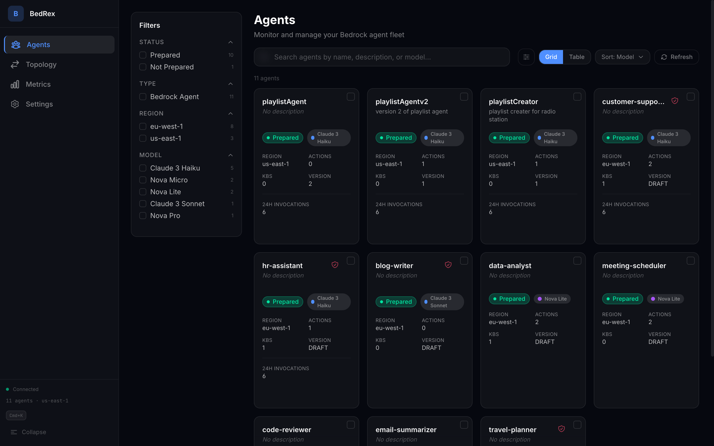
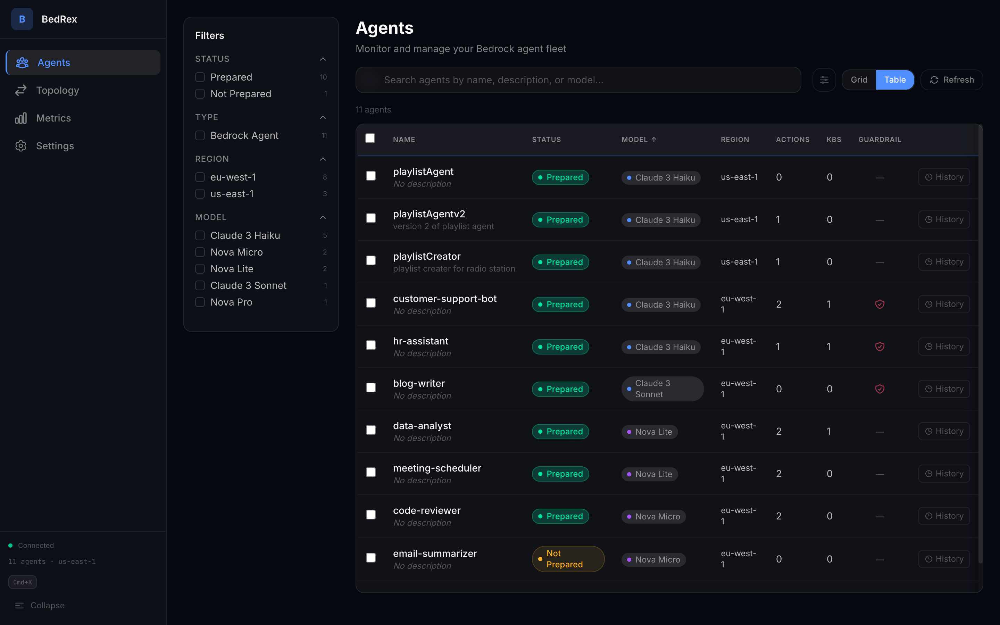
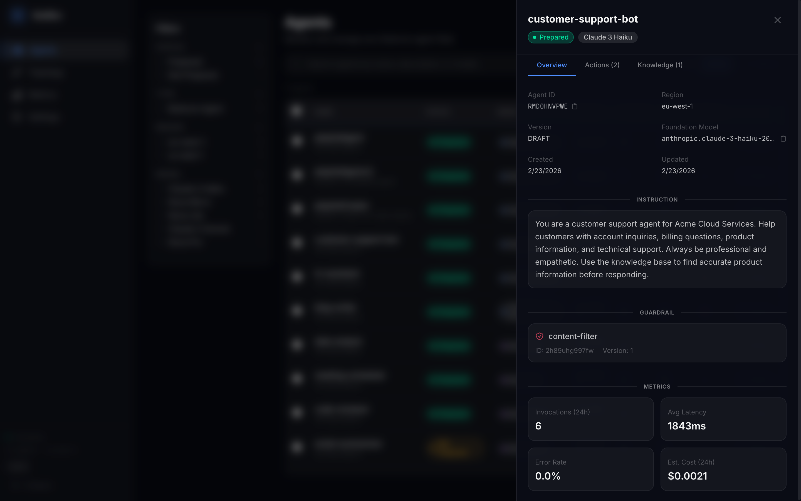
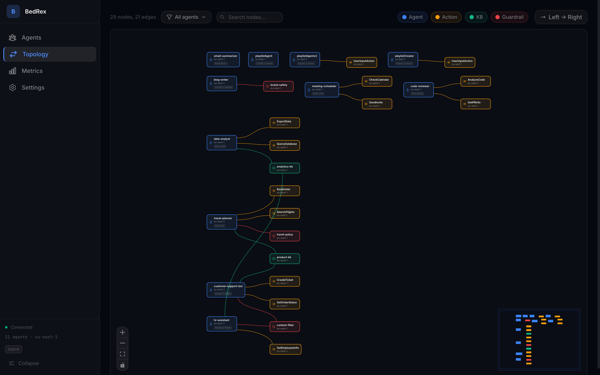
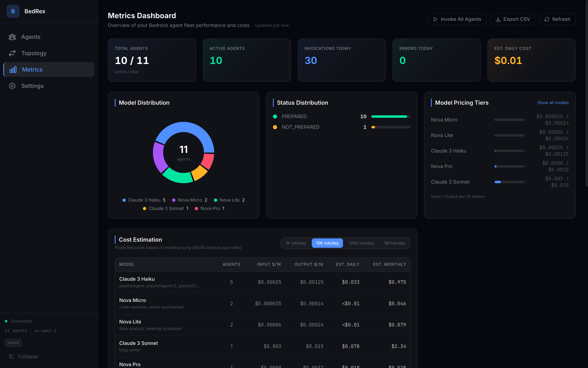
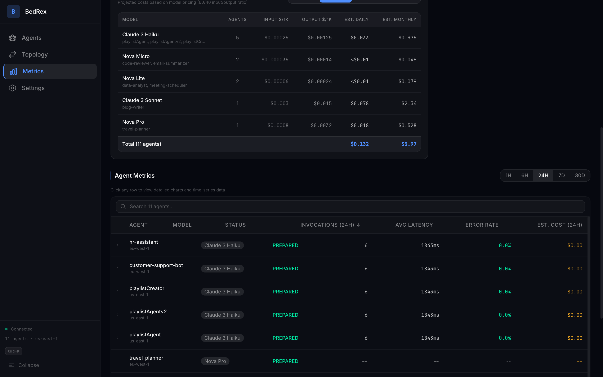
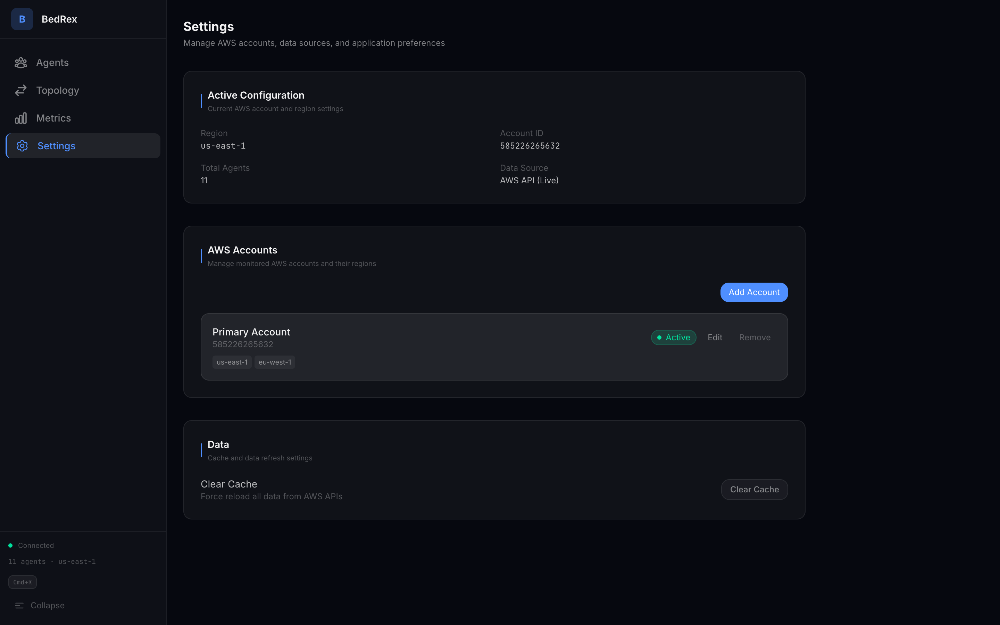

# BedRex

**Monitor and manage your AWS Bedrock agents from a single dashboard.**

BedRex provides real-time visibility into your Amazon Bedrock agent fleet — inventory, topology, CloudWatch metrics, cost analysis, and configuration tracking across multiple accounts and regions.

---

## Screenshots

### Agent Inventory — Grid View
Browse all your Bedrock agents across regions with filtering by status, model, region, and type. Each card shows action groups, knowledge bases, guardrail status, and 24h invocation counts.



### Agent Inventory — Table View
Switch to a compact table layout with sortable columns. Click any row to open the detail drawer with full agent configuration, invoke capabilities, and snapshot history.



### Agent Detail Drawer
Inspect individual agents — view action groups, knowledge bases, guardrail config, foundation model, and version history. Invoke agents directly with custom prompts and compare configuration snapshots.



### Topology Map
Interactive force-directed graph showing relationships between agents, action groups, knowledge bases, guardrails, and foundation models. Filter by node type, search nodes, and switch between layout directions.



### Metrics Dashboard
KPI summary bar with total/active agents, invocations, errors, and estimated daily cost. Includes model distribution chart, status breakdown, pricing tier comparison, and per-model cost projections.



### Fleet Analytics & Cost Estimation
Cost estimation table with projectable token volumes (1K–1M tokens/day), per-agent CloudWatch metrics with latency, error rates, and real cost data. Expandable rows with time-series sparklines.



### Settings
Configure AWS accounts, regions, and manage data sources. Add multiple accounts with cross-account IAM role support, manage cache settings, and toggle between live and mock data modes.



---

## Features

- **Agent Inventory** — View all Bedrock agents across accounts and regions with filtering, search, and sorting
- **Topology Map** — Interactive graph visualization of agents, action groups, knowledge bases, and guardrails
- **CloudWatch Metrics** — Real-time invocation counts, latency, error rates, and token usage from AWS CloudWatch
- **Cost Analysis** — Per-model and per-agent cost estimation based on actual token usage and Bedrock pricing
- **Configuration Snapshots** — Track agent configuration changes over time with diff views
- **Multi-Account Support** — Monitor agents across multiple AWS accounts using cross-account IAM roles
- **Agent Invocation** — Test agents directly from the dashboard with custom prompts

---

## Quick Start

### Docker (recommended)

```bash
git clone https://github.com/bestcloudforme/bedrex.git
cd bedrex
cp .env.example .env
# Edit .env with your AWS_ACCOUNT_ID and AWS_REGION
docker compose up
```

Open http://localhost:3000

> **Demo mode:** Set `USE_MOCK_DATA=true` in `.env` to explore the UI without AWS credentials.

### Development

Prerequisites: Node.js 22+, npm 10+

```bash
git clone https://github.com/bestcloudforme/bedrex.git
cd bedrex
npm install
npm run dev
```

Frontend: http://localhost:5173 | Backend: http://localhost:3001

---

## Environment Variables

| Variable | Default | Description |
|----------|---------|-------------|
| `AWS_ACCOUNT_ID` | — | Your 12-digit AWS account ID (required for live mode) |
| `AWS_REGION` | `us-east-1` | Default AWS region for Bedrock API calls |
| `USE_MOCK_DATA` | `false` | Enable demo mode without AWS credentials |
| `PORT` | `3000` | Port for the web UI (Docker) |
| `LOG_LEVEL` | `info` | Log verbosity: trace, debug, info, warn, error |
| `CORS_ORIGIN` | `http://localhost:5173` | Allowed origins (comma-separated) |
| `CACHE_ENABLED` | `true` | Toggle in-memory caching |

### AWS Credentials

BedRex uses the standard AWS credential chain. Options:

1. **AWS CLI profiles** — Configure with `aws configure` (recommended for local dev)
2. **Environment variables** — Set `AWS_ACCESS_KEY_ID` and `AWS_SECRET_ACCESS_KEY`
3. **Docker volume mount** — docker-compose mounts `~/.aws` automatically

Required IAM permissions:
- `bedrock:ListAgents`, `bedrock:GetAgent`
- `bedrock:ListAgentActionGroups`, `bedrock:ListAgentKnowledgeBases`
- `bedrock-agent-runtime:InvokeAgent`
- `cloudwatch:GetMetricData`
- `sts:GetCallerIdentity`

---

## Architecture

```
bedrex/
├── packages/
│   ├── backend/     Express + TypeScript + AWS SDK v3
│   ├── frontend/    React 19 + Vite + TailwindCSS v4
│   └── shared/      Shared types and constants
├── infra/           AWS CDK (optional cloud deployment)
├── docker-compose.yml
└── .env.example
```

**Tech Stack:**
- **Frontend:** React 19, TypeScript, TailwindCSS v4, Recharts, React Flow, TanStack Query, Zustand
- **Backend:** Express, TypeScript, AWS SDK v3 (Bedrock, CloudWatch, STS)
- **Build:** Turborepo, Vite, tsx
- **Infrastructure:** Docker Compose, nginx (optional: AWS CDK)

---

## Contributing

1. Fork the repository
2. Create a feature branch (`git checkout -b feature/my-feature`)
3. Make your changes
4. Run `npm run build` to verify TypeScript compilation
5. Submit a pull request

---

## License

MIT — see [LICENSE](LICENSE) for details.
